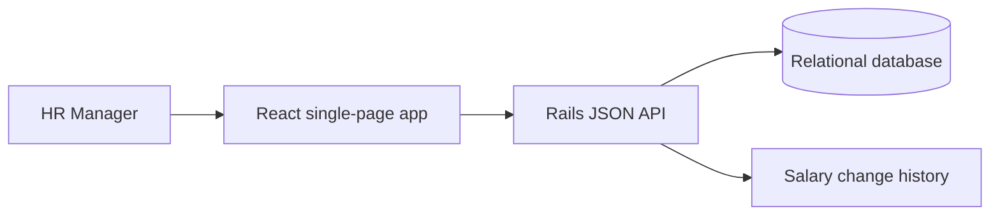

# Design notes

## Shape

Employees hold identity and organization attributes; current salary is a separate row with amount in minor units and currency. Salary edits update the current row and append an immutable history record in one database transaction. The API returns paginated records and database-derived aggregate results; the browser does not load all 10,000 salaries to calculate insights.

## Decisions

- Keep the app a modular monolith: one deployment boundary and transaction across current pay and its audit event.
- Store amounts as integer minor units, never binary floating point. Require currency at every display and aggregation boundary.
- Search is bounded (page size capped), and common filters are indexed. 10,000 rows do not justify distributed search or a separate analytics store.
- Aggregations group by currency and organizational dimension. Cross-currency totals are intentionally absent until ACME defines an FX source/date policy.
- Generate deterministic fake data to make demos and tests repeatable without exposing personal information.

## Production boundary

This exercise's demo does not constitute a payroll system. Authentication/authorization, request-level security review, encryption, secrets management, backups, and operational monitoring are prerequisites for real employee data.
