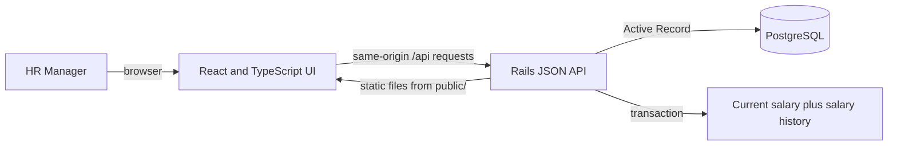

# System design

## Request and deployment shape

The repository contains both sources. Docker builds `frontend/` with Vite and copies the static output into Rails' `public/` directory. One web service serves the built UI and API. Local development uses Vite's `/api` proxy to the Rails server.

## Data and boundaries

Employees own organization attributes. A current salary row stores an integer amount in minor units and a currency. Salary edits go through `SalaryUpdater`: validate amount, currency, reason, and actor label; then update the current salary and create a history record in one transaction. Salary history rejects updates and deletion. In this unauthenticated demo, the actor is always the literal `HR Manager`, not a verified user.

`EmployeeDirectory` caps requests at 100 rows and eager-loads current salary for the returned page. `SalaryInsights` filters and aggregates within PostgreSQL, grouping by country, department, and currency. The UI never combines different currencies. `db/seeds.rb` creates deterministic synthetic records only when the database is empty.

## Operational boundary

`render.yaml` describes a Rails web service and PostgreSQL database; it is a blueprint, not proof that the app is deployed. Authentication, authorization, secrets and key controls, backups, retention, monitoring, and privacy review are required before real employee compensation data is used.
